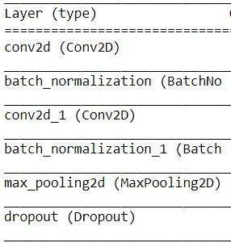

# Age and Emotion Recognition

In this project, I build a deep learning implementation to estimate the age and emotion of detected faces. This can be applied to an image or live detection from a webcam. However, I can't do a report on live detection due to limited computing resources (the video runs very slow).

## 1. Face Detection

For the face detection, I use 2 methods: OpenCV & Deep Learning (MTCNN). Then I compare it and use the better ones, this is how it look:

So the MTCNN (*Multi-Task Cascaded Convolutional Neural Network*) is more accurate and robust to face with different directions. The MTCNN architecture is complex to implement, but there is a third party MTCNN project from this [Github Repo](https://github.com/ipazc/mtcnn) so everyone can use the model just by installing the package. Also, you can read more about the architecture on this [paper](https://kpzhang93.github.io/MTCNN_face_detection_alignment/).

## 2. Emotion Detection

### Dataset

The [data](https://www.kaggle.com/ashishpatel26/facial-expression-recognitionferchallenge) have around 30k images with 6 different emotions. Also, it's already cropped and aligned so no need to detect face before for model training. However, the 6 emotions don't have an equal distribution so I only select *Happy, Sad, and Neutral* (3,4,6) emotion. This is how the distributions and the images look like:

### CNN Model

I use this convolutional blocks 3 times before it goes through Flatten and Dense layers. Also, in model fitting, I use callbacks namely EarlyStopping and ReduceLRonPlateau to reduce overfitting and get adaptable learning rate. The model was trained on 100 epochs and stop at Epoch 58 because the metrics (accuracy) didn't improve anymore.

### Model Result

The model have a pretty good accuracy both on training and validation set at around 80%. However the model can differ Sad and Neutral emotion clearly, which can be seen on the confusion matrix. (0 is Happy, 1 is Sad, 2 is Neutral)

## 3. Age Estimation

### Dataset

The [data](https://www.kaggle.com/abhikjha/appa-real-face-cropped) have a fairly small size, with around 7k images. It's already cropped and aligned so no need to detect face before for model training. This is how the distributions and the images look like:

### CNN Model (Transfer Learning)

In modelling, I use transfer learning method, which is using pretrained model. The popular ones is ResNet50, which I used for the CNN model by freezing all ResNet50 and changing the input output. The model was trained on 30 epochs and stop at Epoch 19 because the metrics (mean absolute error) didn't improve anymore.

### Model Result

The model have a decent mean absolute error (around 7). For human, it's sometimes hard to predict someone's age, right?

## 4. Combine Model

It's pretty simple to combine the model. First, I used the face detector and extract faces so it can be used for age and emotion recognition model. With OpenCV, it's easy to put texts and draw a custom rectangle for that texts. So this is how the final model predict unseen data:

- **Mo Salah (Liverpool player), Real age: 28**

- **Chelsea players, Real age (from left to right): 30, 22, 26, 28**

- **Cristiano Ronaldo, Real age: 31**

  

  

- **Lionel Messi, Real age: 29**

  

  

- **Taylor Swift, Real age: 31**

- **Twenty One Pilots (Joshua Dun, Tyler Joseph), Real age: 29, 29**

## 5. Further Work

- Many others face detection architecture have state-of-the-art accuracy, such as Google FaceNet
- The model can be implemented for live detection if you have enough computing resources
- Try to include other emotion if there is enough data
- Use classification (age range) instead of regression (age) for the age estimation

**Thanks for reading, stay healthy and have a good day!**
